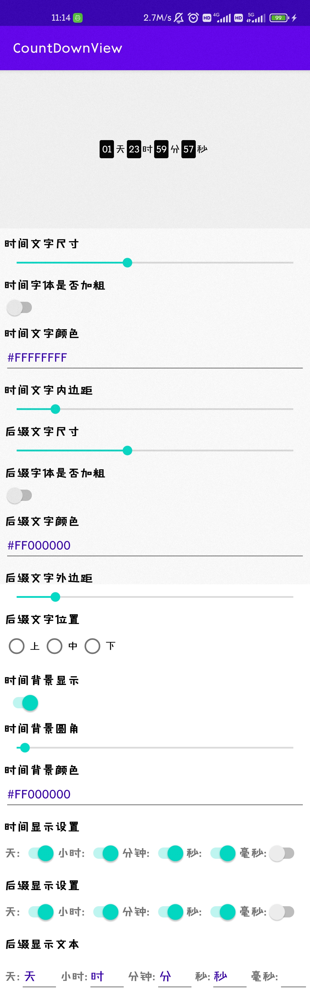

# CountDownView
Android Custom CountDownView

<p align="center">
  Visit Count<br>
  
</p>

### Import

```groovy
implementation 'com.github.RDSunhy:CountDownView:v1.0.0'
```

### Sample




### Xml

```xml
<top.sunhy.countdownview.CountDownView
    android:layout_width="wrap_content"
    android:layout_height="wrap_content"/>
```

### Code

```kotlin
val startTime = System.currentTimeMillis()
val endTime = startTime + 2 * 24 * 60 * 60 * 1000
countDownView.start(startTime, endTime)

val millisecond = 2 * 24 * 60 * 60 * 1000
countDownView.start(millisecond)

countDownView.config().apply {
    timeTextSize = 12f.sp
    timeTextColor = Color.WHITE
    suffixGravity = CountDownViewConfig.GRAVITY_TOP
    isShowDay = true
    daySuffixText = "天"
    isShowTimeBg = true
    //...
}
countDownView.updateConfig()
```

### Customization

| attr           | type  | default |
| -------------- | ----- | ------- |
| timeTextSize   | float | 14f.sp  |
| suffixTextSize | float | 24f.sp  |
| timeTextColor | int | Color.WHITE  |
| timeBgColor | int | Color.BLACK  |
| suffixTextColor | int | Color.BLACK  |
| isTimeTextBold | boolean | false  |
| isSuffixTextBold | boolean | false  |
| daySuffixText | string | 天  |
| hourSuffixText | string | 时  |
| minuteSuffixText | string | 分  |
| secondSuffixText | string | 秒  |
| milliSecondSuffixText | string |   |
| isShowDay | boolean | true  |
| isShowDaySuffix | boolean | true  |
| isShowHour | boolean | true  |
| isShowHourSuffix | boolean | falsetrue|
| isShowMinute | boolean | true  |
| isShowMinuteSuffix | boolean | true  |
| isShowSecond | boolean | true  |
| isShowSecondSuffix | boolean | true  |
| isShowMilliSecond | boolean | true  |
| isShowMilliSecondSuffix | boolean | true  |
| timeBgRadius | int | 2.dp  |
| timeBgPadding | int | 2.dp  |
| suffixDayHorizontalMargin | int | 2.dp  |
| suffixHourHorizontalMargin | int | 2.dp  |
| suffixMinuteHorizontalMargin | int | 2.dp  |
| suffixSecondHorizontalMargin | int | 2.dp  |
| suffixMilliSecondHorizontalMargin | int | 2.dp  |
| suffixGravity | int | CountDownViewConfig.GRAVITY_CENTER  |
